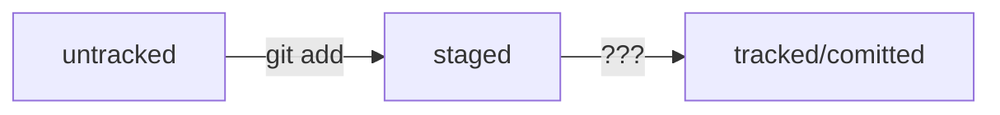

# Шпора по ГИТ


### Начальные настройки

Установи ГИТ с сайта
Коммандную строку ты знаешь - в гитбаш - те же команды + команды гита - см ниже

Задать глоб параметры локального гита - имя и емайл
``` bash
git config --global user.name "UNAME"		
git config --global user.email email
```

См конфиг
``` bash
git config --list		
cat ~/.gitconfig		
```

Создай уд репу на сайте - https://github.com


Создать пару ключей публичный и секретный на локальном компе и пропиши публ ключ на сайт гитхаб
``` bash
ssh-keygen -t ed25519 -C aserp3@gmail.com		
ls -a ~/.ssh		
ssh -T git@github.com		
```


### ОСтновные команды работы с конкретным проектом 

Инициализация в папке
``` bash
git init
```

#### Создай файл README.md ! - описание проекта - оч. хороший тон и на гитхаб по умолчанию открывается именно он
см его формат .md - оч удобная разметка + поддерживает много языков , даже схемы
``` bash
touch README.md
```

Проверка статуса
``` bash
git status		
```

Подключить Все или конкретные файлы к проекту после изменения файлов и перед коммитом
``` bash
git add .		
git add readme.txt		
```

Коммит проекта
``` bash
git commit -m "Коммент"		
```

См лог изменений
``` bash
git log		
```

Подключить удаленную репу к локальной
``` bash
git remote add origin https://github.com/ASerp3/GIT_P.git		
```

Создать ветку 
``` bash
git branch -M master		
```

Отправить у даленную репу из локальной
``` bash
git push -u origin master		
```

См состояние уд.репы
``` bash
git remote -v	
```

#### Разное

Хеш - уникаьный ИД коммита

Получить сокращённый лог — 
``` bash
git log --oneline
```

Метка HEAD указаывает на последний коммита. Ее можно указать вместо конкретного хеша.

#### Типичный жизненный цикл файла в Git
Может показаться, что файлы в репозитории попадают в разные состояния хаотично. На практике это не так, и у большинства файлов вполне предсказуемый путь.

Файл только что создали. Git про него ещё ничего не знает. Состояние: untracked.
Файл добавили в staging area с помощью git add. Состояние: staged (+ tracked).
Возможно, изменили файл ещё раз. Состояния: staged, modified (+ tracked).
Обратите внимание: staged и modified у одного файла, но у разных его версий.
Ещё раз выполнили git add. Состояние: staged (+ tracked).
Сделали коммит с помощью git commit. Состояние: tracked.
Изменили файл. Состояние: modified (+ tracked).
Снова добавили в staging area с помощью git add. Состояния: staged (+ tracked).
Сделали коммит. Состояния: tracked.
Повторили пункты 
4
−
7
4−7 много-много раз.




