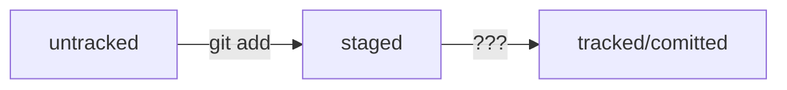
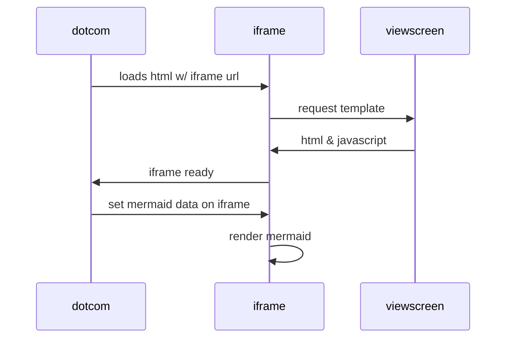

# Шпора по ГИТ


### Начальные настройки

Установи ГИТ с сайта
Коммандную строку ты знаешь - в гитбаш - те же команды + команды гита - см ниже

Задать глоб параметры локального гита - имя и емайл
``` bash
git config --global user.name "UNAME"		
git config --global user.email email
```

См конфиг
``` bash
git config --list		
cat ~/.gitconfig		
```

Создай уд репу на сайте - https://github.com


Создать пару ключей публичный и секретный на локальном компе и пропиши публ ключ на сайт гитхаб
``` bash
ssh-keygen -t ed25519 -C aserp3@gmail.com		
ls -a ~/.ssh		
ssh -T git@github.com		
```


### Оcновные команды работы с конкретным проектом 

Инициализация в папке
``` bash
git init
```

#### Создай файл README.md ! - описание проекта - оч. хороший тон и на гитхаб по умолчанию открывается именно он
см его формат .md - оч удобная разметка + поддерживает много языков , даже схемы
``` bash
touch README.md
```

Проверка статуса
``` bash
git status		
```

Подключить Все или конкретные файлы к проекту после изменения файлов и перед коммитом
``` bash
git add .		
git add readme.txt		
```

Коммит проекта
``` bash
git commit -m "Коммент"		
```

См лог изменений
``` bash
git log		
```

Подключить удаленную репу к локальной
``` bash
git remote add origin https://github.com/ASerp3/GIT_P.git		
```

Создать ветку 
``` bash
git branch -M master		
```

Отправить у даленную репу из локальной
``` bash
git push -u origin master		
```

См состояние уд.репы
``` bash
git remote -v	
```

Изменить последний коммит , например его описание:
``` bash
git commit --amend -m "Добавить главную страницу и стили"
```
####  Откаты, отмены, возвраты

Убрать файл из staging поможет команда 
``` bash
git restore --staged <file>
````

Чтобы «сбросить» все файлы из staged обратно в untracked/modified, можно воспользоваться командой git restore --staged .  : она сбросит всю текущую папку (.).

«Откатить» коммит — 
``` bash
git reset --hard <commit hash>
```
Теперь коммит b576d89 стал последним: вся дальнейшая разработка будет вестись от него. Файл также вернулся к тому состоянию, в котором был в момент этого коммита. А коммит 7b972f5 Git просто удалил.


####  Сравнение изненений

Эта команда сравнит последнюю закоммиченную версию файла с текущей (изменённой) версией.
``` bash
git diff
```
по умолчанию команда git diff не показывает изменения в staged-файлах — только в modified.
Чтобы всё-таки просмотреть изменения в staged, нужно использовать флаг --staged: 
``` bash
git diff --staged
```

команда git diff A B выводит список инструкций: как превратить состояние A в состояние B. Если поменять A и B местами (git diff B A), то и инструкции будут обратные: как превратить B в A. При этом все зелёные строки станут красными, и наоборот. Попробуйте git diff <конец> <начало>. Вместо HEAD (конец сказки) можно также передать хеш.

``` bash
git diff <hesh1> <hash2>
```

#### Игнор некоторых файлов

в .gitignore указывают все файлы, которые нужно игнорировать (по одному имени на строку). Но часто удобнее использовать шаблоны. Шаблон, или правило, — это способ указать сразу на несколько файлов с однотипными названиями.
Правила из .gitignore применяются только к новым (untracked) файлам. Если файл уже попал в staging area или в коммит, то правила на него не распространяются.

Просто название файла

Если строка начинается с #, то это комментарий, и .gitignore не будет его учитывать.

Символ звёздочки (*) соответствует любой строке, включая пустую

Вопросительный знак ? соответствует одному любому символу.

Квадратные скобки, как и вопросительный знак, соответствуют одному символу. При этом символ не любой, а только из списка, который указан в скобках.

Косая черта, или слеш (/), указывает на каталоги

Функция парных звёздочек (**) похожа на функцию одинарной (*). Отличие в том, как они работают с вложенными папками. Двойная звёздочка может соответствовать любому количеству таких папок (в том числе нулю). Одинарная может соответствовать только одной.

Восклицательный знак (!) - инверсия правила

#### Разное

Хеш - уникаьный ИД коммита

Получить сокращённый лог — 
``` bash
git log --oneline
```

Метка HEAD указаывает на последний коммита. Ее можно указать вместо конкретного хеша.

#### Типичный жизненный цикл файла в Git
Может показаться, что файлы в репозитории попадают в разные состояния хаотично. На практике это не так, и у большинства файлов вполне предсказуемый путь.

Файл только что создали. Git про него ещё ничего не знает. Состояние: untracked.
Файл добавили в staging area с помощью git add. Состояние: staged (+ tracked).
Возможно, изменили файл ещё раз. Состояния: staged, modified (+ tracked).
Обратите внимание: staged и modified у одного файла, но у разных его версий.
Ещё раз выполнили git add. Состояние: staged (+ tracked).
Сделали коммит с помощью git commit. Состояние: tracked.
Изменили файл. Состояние: modified (+ tracked).
Снова добавили в staging area с помощью git add. Состояния: staged (+ tracked).
Сделали коммит. Состояния: tracked.
Повторили пункты 
4
−
7
4−7 много-много раз.




####  Примеры .md 




